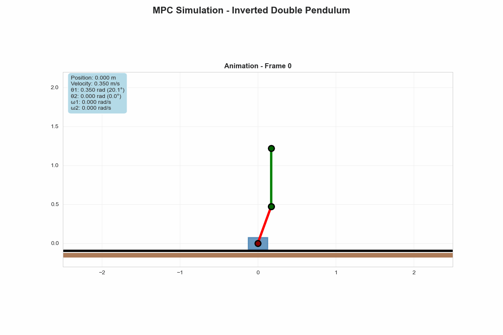

# CMC12-Exam

This project implements a linearized Model Predictive Control approach to stabilize the system around the upright equilibrium position.

Group:
- Lucas Ribeiro
- William Nelton
- Márcio Vicente



### System Description

* **Cart** : Movable base with mass `m0`
* **Pendulum 1** : Lower pendulum with mass `m1` and length `L1`
* **Pendulum 2** : Upper pendulum with mass `m2` and length `L2`
* **Control Input** : Horizontal force applied to the cart
* **State Variables** : Cart position, pendulum angles, and their derivatives

## Installation

### Prerequisites
Create a virtual environment and install the required libraries:
```bash
python -m venv venv
source venv/bin/activate  # On Windows use `venv\Scripts\activate`
pip install -r requirements.txt
```

## Project Structure

```
src/
├── main.py           # Main simulation script
├── mpc.py            # Linear MPC controller implementation
├── pendulum.py       # Double inverted pendulum system model
├── config.py         # Configuration parameters
└── utils.py          # Visualization and utility functions
requirements.txt      # Required Python packages
README.md             # Project documentation
results/              # Some experimental results and plots
```

## Usage

### Basic Simulation

```python
python main.py
```

This will run a simulation with default parameters and generate:

* State trajectory plots
* Control input plots
* Performance metrics
* Animated pendulum visualization

### Custom Configuration

Modify `config.py` to adjust system parameters:

```python
config = SimpleNamespace(
    # System parameters
    m0=1.5,      # Cart mass (kg)
    m1=0.5,      # Pendulum 1 mass (kg)
    m2=0.75,     # Pendulum 2 mass (kg)
    L1=0.5,      # Pendulum 1 length (m)
    L2=0.75,     # Pendulum 2 length (m)
  
    # Initial state [x, θ1, θ2, ẋ, θ̇1, θ̇2]
    x0=np.array([0.0, 0.6, -0.6, 0.0, 0.0, 0.0]),
  
    # MPC parameters
    N=20,        # Prediction horizon
    dt=0.05,     # Time step (s)
  
    # Cost matrices
    Q=np.diag([10, 100, 100, 1, 10, 10]),  # State weights
    R=np.array([[0.1]]),                    # Control weights
    Qn=np.diag([10, 100, 100, 1, 10, 10]) * 2,  # Terminal weights
  
    # Constraints
    x_max=np.array([2, 0.5, 0.5, 3, 5, 5]),     # State upper bounds
    x_min=-np.array([2, 0.5, 0.5, 3, 5, 5]),    # State lower bounds
    u_max=np.array([50]),                         # Control upper bound
    u_min=-np.array([50]),                        # Control lower bound
  
    # Simulation parameters
    N_sim=400    # Number of simulation steps
)
```
